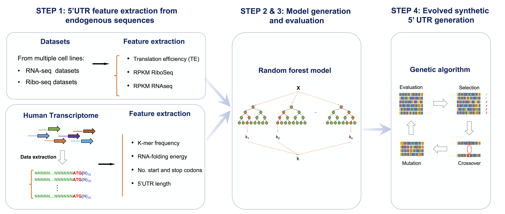

# Design of evolved synthetic 5'UTR sequences for enhanced protein production

The goal of this workflow is to generate novel 5'UTR sequences with optimized features to maximize the translation efficiency of the constructs. 
This is achieved in 4 steps:

- Step 1. **Feature extraction** from endogenous sequences 
- Step 2. **Model generation** using extracted features to predict Translation Efficiency (TE), using Random Forest
- Step 3. **Model evaluation** 
- Step 4. **Generation of novel 'evolved' sequences** using a Genetic Algorithm

This repository is the code accompanying the paper:High-Throughput 5’ UTR Engineering for Enhanced Protein Production in Non-Viral Gene Therapies. Jicong Cao*, Eva Maria Novoa*, Zhizhuo Zhang*, William C.W. Chen, Dianbo Liu, Gigi C G Choi, Alan S L Wong, Claudia Wehrspaun, Manolis Kellis, Timothy K Lu. bioRxiv 2020. doi: https://doi.org/10.1101/2020.03.24.006486





## Table of Contents
- [Step 1. Design of 5'UTR sequences](#Step-1-Design-of-5UTR-sequences)
- [Step 2. 5'UTR model generation](#Step-2-5UTR-model-generation)
- [Step 3. 5'UTR model evaluation](#Step-3-5UTR-model-evaluation)
- [Step 4. Generation of novel evolved 5'UTR sequences](#Step-4-Generation-of-novel-evolved-5UTR-sequences)
- [Additional data sources](#Additional-data-sources)
- [Dependencies and versions](#Dependencies-and-versions)
- [Citation](#Citation) 
- [Contact](#Contact) 
 

## Step 1. Feature extraction of 5'UTR sequences 

**Goal**: Extract features that correspond to optimal 5'UTRs to maximize the translation efficiency (TE).

The features extracted from endogenous sequences (which will be used to generate models later) are:
- K-mer frequency: k=1-6
- RNA folding energy for: i) the first 100bp of the 5'UTR, ii) last 30bp(15bp UTR+ 15bp CDS), iii) whole (5UTR+15bp CDS), iv) 5'UTR only, with/without considering G-quadruplex 
- Codon usage (of the 15 first bp of the CDS region)
- Number of start and stop codons in teh 5'UTR
- 5'UTR length

### Running the code: 
``` 
python run_pipeline.py feature_extract --input_fasta data/gencode_v17_5utr_15bpcds.fa --output_dir output/
```

## Step 2. 5'UTR model generation

**Goal**: Generate model  that correspond to optimal 5'UTRs to maximize the translation efficiency (TE).

**Algorithm used**: **Random Forest** to build a prediction model 

The model trained for human sequences is available as part of this repository. 

### Running the code: 
``` 
python run_pipeline.py model_build --prefix output/input.fa --annotation_file data/df_counts_and_len.TE_sorted.Muscle.with_annot.txt --min_rna_rpkm 5 --min_riboseq_rpkm 0.1 --model 1 --out output/muscle_randomforest.model
```

## Step 3. 5'UTR model evaluation

**Goal**: Evaluate different type of machine learning models in predicting translation efficiency, and decide which model to use in the next step
Results: Using 10-fold cross-validation, we obtained  0.71 pearson correlation in TE prediction, and 0.74 in RNA expression prediction.

#### Running the code:

```
python run_pipeline.py model_eval --prefix output/input.fa --annotation_file data/df_counts_and_len.TE_sorted.Muscle.with_annot.txt --min_rna_rpkm 5 --min_riboseq_rpkm 0.1 --modellist 1,2,3,4 --out output/muscle_eval.xlsx
```


## Step 4. Generation of novel evolved 5'UTR sequences

**Goal**: Evolve endogenous 5'UTR sequences to obtain 5'UTRs with increased translation efficiency

**Algorithm used**: **Genetic Algorithm (GA)**

Additional details of individual steps are described in `makefile` file)

#### Running the code:
```
python run_pipeline.py  sequence_generate --n_total 3585 --prefix output/input.fa --annotation_file data/df_counts_and_len.TE_sorted.Muscle.with_annot.txt --min_rna_rpkm 5 --min_riboseq_rpkm 0.1 -t ribo  -m output/muscle_randomforest.model  -o output/
```

## Additional data sources 

- df_counts_and_len.TE_sorted.with_annot.txt: Muscle RNA-seq and Ribo-seq data from publicly available datasets (PC3, HEK and muscle)
- entiredata_2015_12_25_3-25_pm: RNA binding motif, downloaded from http://cisbp-rna.ccbr.utoronto.ca/
 
## Dependencies and versions

#### Create a Conda Environment with all the dependencies:
```
conda env create -f environment.yml
```

Here we list the specific versions of individual dependencies needed:

| Software | Version |
| ------------- | ------------- |
| python  | 3.5  |
| viennarna  | 2.1.9  |
| R  | 3.5.1  |
| biopython  | 1.72 |
| r-randomforest  | 4.6.14 |
| r-ga  | 3.2  |
| r-seqinr  | 3.6.1  |
| r-glmnet  | 2.0.16  |


## Citation
If you find this work useful, please cite: 

High-Throughput 5’ UTR Engineering for Enhanced Protein Production in Non-Viral Gene Therapies. Jicong Cao*, Eva Maria Novoa*, Zhizhuo Zhang*, William C.W. Chen, Dianbo Liu, Gigi C G Choi, Alan S L Wong, Claudia Wehrspaun, Manolis Kellis, Timothy K Lu. bioRxiv 2020. doi: https://doi.org/10.1101/2020.03.24.006486


## Contact
If you have any issues using this code, please open an Issue in the GitHub repository. Thanks!


#### Last Updated: February 2021

